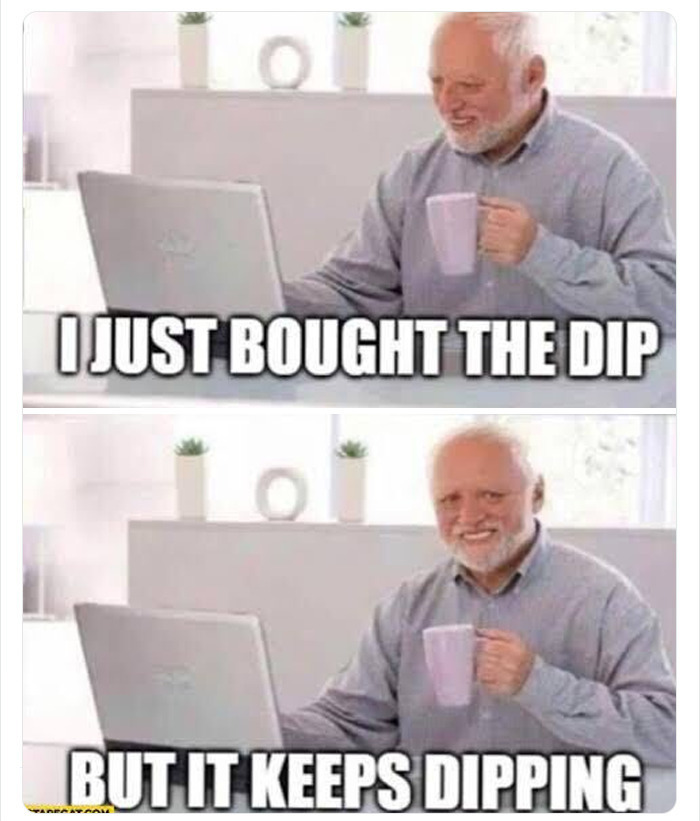

<!-- TODO move some bullet points into notes? -->

# <small>Algo-trading v kryptu</small>

Trh z pohledu poskytovatele likvidity


Jan Škoda

note: intro story?
define algo-trading?
co je likvidita a proc je potrebna, jak se poskytuje, jak vypada algo-trading obecne a jake ma problemy. obnazime i nejake problemy rucniho tradingu. konflikty v trhu.

<!-- 2m -->

---

## Intro

- Jan Škoda
- absolvent AI na MFF UK
- ex Head of Research v Quantlane
- Market maker <a href="https://liquiditylabs.xyz/">Liquidity Labs</a>
- Poskytovatel historických dat <a href="https://crypto-lake.com/">Crypto Lake</a>

<!-- 4m -->

---

## 1. Poskytování likvidity

note: detaily strategie, kterou se zabýváme my
note: uniswap analogie

<!-- 1m -->

--

## Likvidita aktiva

- Aktivum je:
  - Likvidní = lze snadno a s nízkými náklady koupit / prodat
  - Nelikvidní = vysoké transakční náklady, prodej trvá dlouho, slippage, nestabilní cena

<!-- 2m -->

--

## Likvidita BTC vs LTC

<div style="margin: 0 50px 0 50px;">
  <div style="display: flex; justify-content: space-between; gap: 10px;">
      
      
  </div>
  <small>Slippage BTC a LTC, zdroj: Kraken Analytics</small>
</div>

note: poskytovani likvidity = mit otevrene limit ordery na burze
note: pomalejší exekuce je lepší, ale hrozi pohyb ceny
note: tvar order booku a pokles ceny btc

<!-- 5m -->

--

## Cíl: maximalizovat likviditu

--

## Poskytovatelé likvidity (*LP*)

- Uzamknou své tokeny do buy i sell limit orderů (např. Binance CEX) nebo AMM pozic (např. Uniswap DEX)
- Čelí rizikům hacků, krachů burz, měnících se cen a adverse selection {.fragment}
- Očekávají výnosy ze spreadů (order book) nebo poplatků (AMM) {.fragment}
- Někdy jsou placeni burzami (rebates) nebo projekty vydávajícími tokeny {.fragment}

<!-- 3m -->

--

## Order book příklad


note: co kdyz prijde market order
note: zisk ze spreadu, ztrata pri volatilite

<!-- 5m -->

---

<!-- ## O Liquidity Labs

- tři roky v trhu, one man show většinu času
- nespekulujeme, nehádáme budoucí cenu
- spolupracujeme s projekty, vydavateli tokenů a burzami
- s (DeFi) altcoiny, na CEXech
- cíl: přispět ke stabilitě, snížit transakční náklady


note: jsme financováni tokenovými projekty a burzami, nejen z příjmů z obchodování. to je unikátní v algo-tradingem.

--
-->

## Jak fungují Liquidity Labs

- Python algo-trading platforma
  - Vysoký výkon, nízká latence (0.010 s)
  - Nízké poplatky (10 bps -> 2.5 bps -> -1 bps)
  - Strategie a indikátory od spolupracujících quantů
  - Vyhodnocování v reálném čase

note: co dela algo trading platforma
note: nizke poplatky davaji smysl nizkovynosovym strategiim.
note: vyhodnoceni -> nalezeni chyb


<!-- 3m -->

--

## Výkon

- Odpovídání na pakety ještě před jejich přijetím
- Realita: burzy jsou pomalé (10 -- 100 ms) {.fragment}

---

## Decentralizace

- v DeFi je market-making automatizovaný AMM smart kontrakty
- výhoda: každý se může stát poskytovatelem likvidity {.fragment}

note: jsem fanda defi
note: kazdy muze poskytovat likviditu a neco na tom vydelat

--

## Ziskovost AMM


<small>Uniswap v3 ETH/USDC pool. Zdroj: <a href="https://crocswap.medium.com/">https://crocswap.medium.com/</a></small>

--

## Proč jsou AMM ztrátová?

- Impermanent loss
- Nízký obrat, vysoká volatilita
- Poplatky nestačí na pokrytí ztrát
- Poplatky se nepřizpůsobují tržním podmínkám (volatilitě) {.fragment}
  - V order booku MM jen rozšíří spread

note: vysvetlit volatilitu
note: APRka lzou

--

## DEX řešení?

- Order book DEXes
  - <a href="https://openserum.io/">Open Serum</a> (Solana, spot)
  - <a href="https://trade.dydx.exchange/">DyDx</a> (ETH L2, perp)
  - <a href="https://app.hyperliquid.xyz/">Hyperliquid</a> (Hyperliquid L1, perp)
- Dynamické poplatky -- <a href="https://www.crocswap.com/">CrocSwap</a> (AMM) {.fragment}
- Neúspěšné(?) pokusy -- <a href="https://cointelegraph.com/news/bancor-pauses-impairment-loss-protection-citing-hostile-market-conditions">Bancor pozastavuje impermanent loss ochranu</a> {.fragment}

---

## 2. Algotrading obecně

- Podle stylu:
  - arbitráž, mean-reversion, trend-following, párové obchodování
  - front-running, spoofing, manipulace {.fragment}
- Podle implementace: {.fragment}
  - rozhodovací podmínky s naoptimalizovanými parametry
  - založené na modelech strojového učení
- Podle frekvence: {.fragment}
  - *HFT*, střední frekvence, na denních svíčkách
- Podle typu dat: {.fragment}
  - on-chain metriky, zprávy, sentiment na sociálních sítích

note: Kromě MM existuje mnohem více strategií
note: linearni regrese

--

## Proces vývoje strategie

- Idea
  - na základě psychologie/chování, systematické neefektivity
  - malé trhy, kam se nevyplatí vstupovat institucím, nabízí větší výnosy
- Sběr dat
- Backtest
- Optimalizace parametrů
- Živé obchodování

--

## Problémy algo-tradingu

- *Alfa* decay
- Exekuce {.fragment}
  <!-- - Adverse selection u limitních objednávek -->
- Front running a exploitace alg {.fragment}
- Risk premiums {.fragment}
  - "Buy the dip" po každém rychlém -5% pohybu a prodej po 3 dnech
  - Vydělá několikrát 1%, ale pak ztratí 10%+

note: alfa je fancy slovo pro ideu/napad
note: Propady jsou často reakce trhu na rizika

--

## Dip



--

## Skewed returns


note: je uzitecne rozumet jevu nebo mit alespon dlouhodobou statistiku
note: zvysovani kapitalu, paka a yolo
note: napr. poskytovani likvidity, nakupovani dipu, prodavani opci, martingale a dalsi

--

## Backtestování

```python
data = lakeapi.load_data(
  table = 'trades', start = start, end = end,
  symbols = ['BTC-USDT'], exchanges = ['BINANCE'],
)
data['rsi'] = rsi_48h(data['price'])
backtest = vectorbt.Portfolio.from_signals(
  price = data['price'].shift(-10),
  entries = data['rsi'] < 10,
  exits = data['rsi'] > 90,
  fees = 0.0002,
)
backtest.plot_positions().show()
backtest.plot_cum_returns().show()
print(backtest.stats(metrics))
```

note: jupyter notebook
note: pridal jsem short pozice, na futures

<!-- 5 min -->

--


note: SP500 ma sharpe kolem 0.8
note: vysledek nadejny, ale i po backtestu zustava dost otazek

--

## YOLO!...?

- Přesnost simulace exekuce
- Chyby v analýze, v datech {.fragment}
- Overfitting {.fragment}

note: strategie mela prumerny return 7%
note: survival bias, nakupovani dipu & luna example
note: overfitting i rucne s jednim parametrem

---

## 3. Konflikty v trhu

- manipulátoři
- insider tradeři

--

## Manipulace

- Pump & dumps
- Na tokenech s malou tržní kapitalizací a nízkou likviditou {.fragment}
- Manipulace kvete na trzích kde je těžké určit cenu aktiva {.fragment}

--

## Příklad manipulace


<!-- todo better pic! -->

note: Útočník pomalu akumuluje pozici (částečně nakupuje od MM)
note: (volitelné) Útočník platí influencery za propagaci tokenu
note: Útočník agresivně nakupuje, aby pumpoval cenu (většinou od MM)
note: MM musí zpětně odkupovat za vyšší cenu {.fragment}
note: Útočník prodává MM a posledním kupujícím
note: Když cena začne klesat, útočník agresivně prodá zbytek, což způsobí kolaps ceny

--

## Insider trading

- Týmy vydávající tokeny mají přístup k neveřejným informacím
- Členové týmu nebo jeho vedení informací využívají k obchodování před announcementy
- Tyto zisky jsou na účet zbytku trhu a market makerů

--

## Příklad insider tradingu


<a href="https://nypost.com/2022/10/05/house-speaker-nancy-pelosi-has-accrued-millions-from-husbands-trades-report/">Nancy Pelosi (zdroj)</a>

note: jako bokovku dělá i jednu z nejvlivnějších političek v US
note: manžel koupil Nvidii, než se uvažovalo o dotacích
note: manžel koupil Teslu, následně jeho žena prosazovala dotace
note: MM pak rozsiri spready a zaplati to mali investori

--

## Šance jednotlivců

- Manipulace se zprávami (sociální sítě i klasická média)
- Market ordery jsou drahé (poplatky, spread, slippage)

<div class="fragment">


<a href="https://cryptotrade.tools">CryptoTrade.Tools</a>
</div>

note: pokud nejste senator
note: open-source, bezpecnost
note: long-term -> dexy
note: long-term investice a ne spekulativni trading

--

## Je algo-trading pro vás?

- algo-trading je super "sport" {.fragment}
- není to rozhodně "pasivní příjem" po pár večerech {.fragment}
- může být prospěšný i škodlivý {.fragment}

note: je fer, objevovani

---

## Q&A

- Jan Škoda, twitter: <a href="https://twitter.com/jan_skoda">@jan_skoda</a>
- <a href="https://liquiditylabs.xyz/">LiquidityLabs.xyz</a>
- <a href="https://crypto-lake.com/">Crypto-Lake.com</a>, twitter: <a href="https://twitter.com/crypto_lake_com">@crypto_lake_com</a>

<!--
- maloobchodníci, má to smysl?
   - kde to má smysl?
- provozování samostatného projektu s sebou
   - efektivnější než malý tým
   - automatizace
-->
